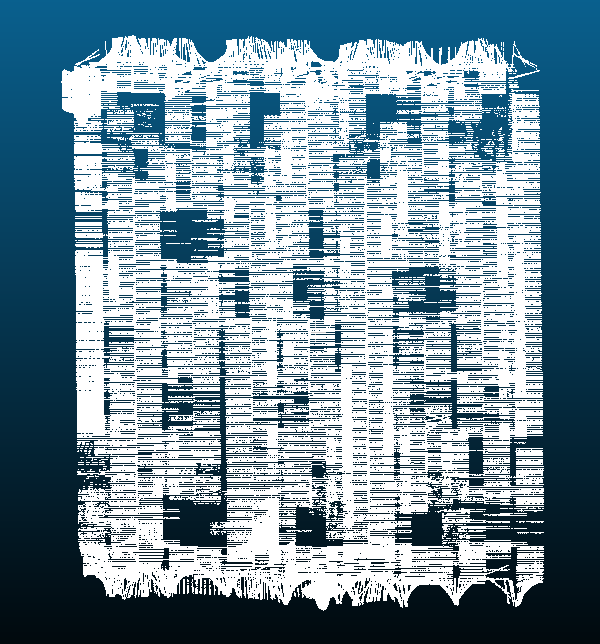
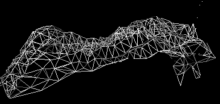
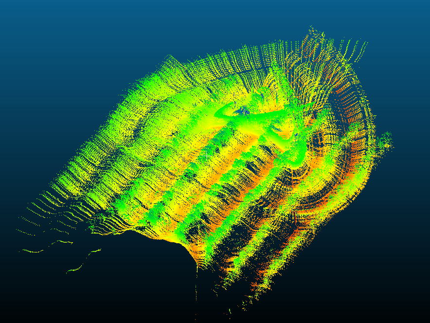
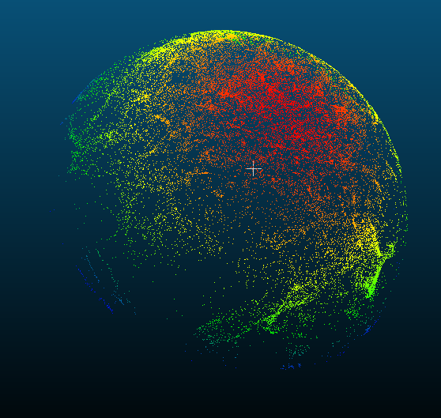
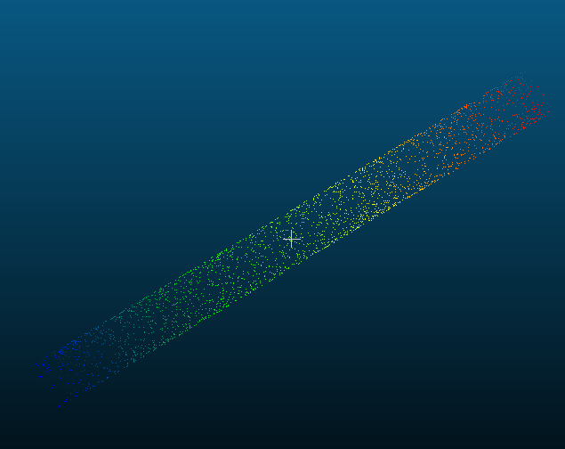
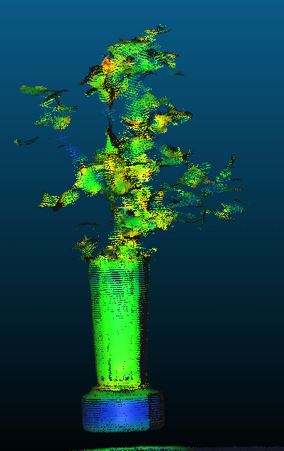

# The Cotton Lidar Project

  Please note that most of the projects contained in this repository are dependent on the repository “anfrench/pcllib” as well as the point cloud library. Clone the anfrench/pcllib [here](https://github.com/anfrench/pcllib) and download/install the [point_cloud_library](http://pointclouds.org/downloads/).

  To compile the code (as is) make a directory called “pclLib” in the same folder as the source code and clone the pcllib to that directory. Otherwise make sure to edit the #includes appropriately so that the compiler can find where you put the necessary files.

## Purpose

  The Cotton Lidar Project is a set programs designed to implement lidar in high throughput phenotyping. These projects were originally wrote for use with canton plants. However, could be used for other applications.

## Projects

* AccuRange
  * Creating a microcontroler to get and log data from an AccuRange lidar unit.

Status: Active

* ### Boll Counts
  * Uses input parameters to cluster Point clouds and count the clusters.
  
  status: IDLE
* ### Canopy / Canopy ARC
  * Indexes each point of a cloud to a grid and creates a point cloud or prints the highest points to a csv file.
  * 
  
  Status: Active

      Added Method to generate the floor of a point cloud.
      Working on polynomial fitting to estimate points at any location.

* ### Cloud merger
  * Using a list of files names, combines all point clouds into one.
  * 
  
  Status: IDLE

* ### Clustering Tests
  * Clusters a file and replaces the clusters with spheres of random colors. each cluster retains its location, approximate size, and approximate points.
  * 

Status: IDLE

* ### Cluster Placement
  * Clusters cloud and replaces the clusters with a single point.

Status: IDLE

* ### Convex hull
  * Creates a canopy for the cloud, fills gaps, and does a quick triangulation to create a convex hull.
  * 
  
  Status: IDLE

* ### Height and Width
  * Finds the widths of a point cloud using slices of the point cloud at different heights.
  
Status: IDLE

* ### LidarGPS
  * Excess Removal
    * Removes white space, extra newlines, and time stamps from lms400 data.
  * GPS Data
    * Contains classes to process GPS data.
  * Lidar GPS to PCD
    * A program to merge strings of GPS data and LMS 511 data to create a point cloud.
    * 
    * 

Status: Active

    All configuration options are now set in a configuration file.
    Adding more Lidar units that can be used.

    Rencent changes:
      A XY shift can now be added to the gps.
      Now have the option to ignore points out of bounds.
      All file names are set in the config file.

* ### LMS Decoders
  * Contains classes to process LMS511, and LMS400.
  
  Status: Active
  
      Changes are being made to make all Lidar units we have usable with the lidar/GPS to pcd Program.
      Making class for AccuRange Lidar.

* ### Normal Estimation
  * Estimates the normals of a point cloud and creates a sphere to display the normal distrobution.
  * 

Status: IDLE

* ### PCD Maker
  * Makes PCD files of simple structures. Was used for testing methods from pclLib/pclMaker.
  * 

Status: Active

    Adding methods to create unique shapes to test other programs.

* ### Plot Heights
  * Using a file of file names and a file containing a series of cropping instructions, finds average heights and writes a CSV file.

  Status: Active
  
      Adding methods to create both floor and Canopy to find the difference rather than absolute height of the points.
      Most current work/changes are being done in canopy.h.

* ### Point Cloud Editor
  * A terminal based program that has several functions to allow you to open and edit point clouds.

Status: IDLE

* ### Smoothing
  * A sample program from the [pointClouds.org](http://pointclouds.org/documentation/tutorials/resampling.php#moving-least-squares) used to smooth point clouds.

Status: IDLE

* ### Turn Table
  * Takes a file of new line delaminated LMS400 scans and projects them onto a rotating z axis.
  * 
  * Making a Point cloud with Photo scan
  * 
  
Status: Active

    Next Steps:
      Using a camera to capture the plant at many angles.
      Using photo scan to create point cloud.
      merging lidar point cloud and photo scan point cloud.
      Filtering points.
      Vectorising plant.